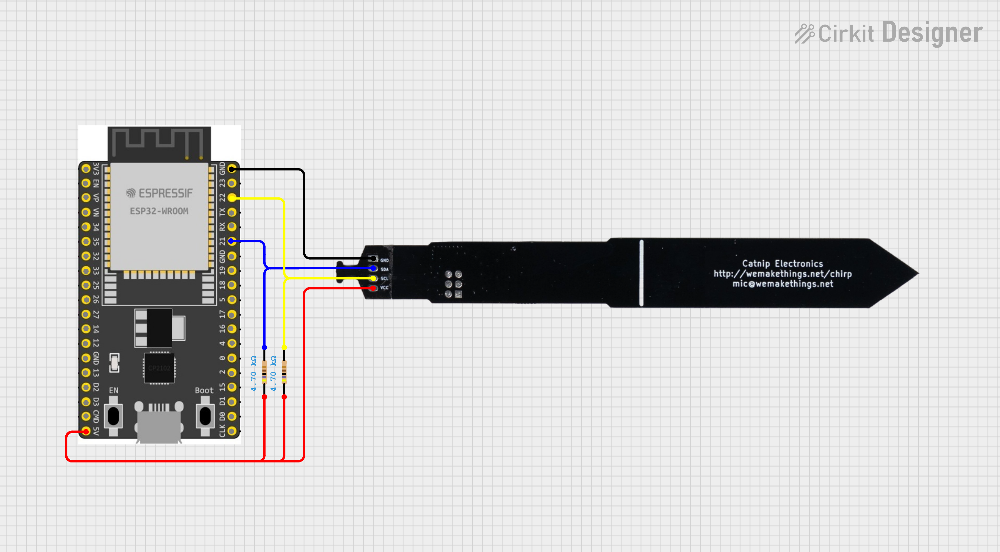

# houseplants

## Overview

This project is a comprehensive Internet of Things (IoT) solution designed to monitor the health of houseplants. It uses an ESP-32 microcontroller connected to a sensor to collect soil moisture, temperature, and light data via the I2C protocol. The data is published to an MQTT broker running on a Raspberry Pi, where a Go-based gateway service subscribes to it. This gateway then sends the data via gRPC to a collector service, which is deployed on an AWS ECS Fargate task. The collected information is then written to an InfluxDB database hosted on AWS Timestream. The entire data pipeline is secured with end-to-end mTLS authentication. Infrastructure is provisioned using Terraform, and continuous integration/continuous deployment (CI/CD) is managed via GitHub Actions for Docker build and deployment.

## Motivation

This project serves as a practical, hands-on learning experience of a modern IoT architecture, incorporating a variety of technologies and best practices, including:

- **Microcontroller programming** with the ESP-32 and Arduino framework.
- **Message queuing** with MQTT for reliable data transmission.
- **Microservices architecture** with separate Go-based services for the gateway and collector.
- **Secure communication** using end-to-end mTLS authentication.
- **Cloud deployment** on AWS ECS Fargate for scalability and reliability.
- **Time-series data storage** with InfluxDB on AWS Timestream for efficient data analysis.
- **Infrastructure as Code (IaC)** with Terraform for automated provisioning and management.
- **CI/CD** with GitHub Actions for automated builds and deployments.

## Components

- **ESP-32 + Sensor**: Collects capacitance (moisture), temperature, and light data from a sensor placed in the soil and publishes it to the MQTT broker.
- **MQTT Broker**: A lightweight message broker running on a Raspberry Pi that receives data from the ESP-32 and forwards it to the gateway service.
- **Gateway Service**: A Go-based service that subscribes to the MQTT broker, processes the incoming data, and sends it to the collector service via gRPC.
- **Collector Service**: A Go-based service that receives data from the gateway and writes it to the InfluxDB database.
- **InfluxDB**: A time-series database hosted on AWS Timestream that stores the collected data for analysis and visualization.

## Setup

### CA Certificate

The `certs` directory contains the scripts and configuration files needed to generate the certificates for end-to-end mTLS authentication. This ensures that all communication between the sensor, gateway, collector, and MQTT broker is encrypted and secure.

Generate a root CA certificate and private key for signing other certificates:

```bash
make ca
```

### MQTT Broker

This project uses the Eclipse Mosquitto MQTT broker. You can install it on a Raspberry Pi or any other suitable device.

1. Determine the IP address of your MQTT broker (e.g., Raspberry Pi):

    ```bash
    hostname -I
    # or
    ipconfig getifaddr en0
    ```

2. Generate the certificates for the MQTT broker and gateway:

    ```bash
    make broker-certs BROKER_HOSTNAME=<MQTT_BROKER_IP>
    ```

3. Start the MQTT broker using Docker Compose:

    ```bash
    docker-compose -f docker/mosquitto/docker-compose.yml up -d
    ```

### ESP-32 and Moisture Sensor

The `esp32` directory contains the Arduino project for the ESP-32 microcontroller. It includes the code to read data from the sensor and publish it to the MQTT broker. Documentation for the I2C moisture sensor used in this project can be found at [I2C Moisture Sensor Documentation](https://github.com/Miceuz/i2c-moisture-sensor/tree/master).

1. Connect the I2C moisture sensor to the ESP-32 as shown in the wiring diagram.
    

2. Generate the client certificate for the ESP-32 and flash it and the CA certificate to the device:

    ```bash
    make sensor-certs
    make upload-certs
    ```

3. Upload the code to the ESP-32:

    ```bash
    cd esp32
    platformio run --target upload
    ```

4. Monitor the serial output:

    ```bash
    platformio device monitor
    ```

5. Configure the ESP-32 Wi-Fi and the MQTT broker by connecting to the `HouseplantMonitorAP` access point and provide the necessary Wi-Fi credentials, MQTT broker IP address, and the houseplant ID.

6. Verify that the ESP-32 connects to Wi-Fi and begins publishing data to the MQTT broker.

### Collector Service and InfluxDB

The `collector` directory contains the Go-based collector service that receives data from the gateway and writes it to InfluxDB. The Terraform configuration in `terraform` provisions the necessary AWS resources, including an ECS Fargate task for the collector service and an InfluxDB instance on AWS Timestream. Use the [apply.sh](./terraform/apply.sh) script to deploy the infrastructure.

### Gateway Service

The `gateway` directory contains the Go-based gateway service that subscribes to the MQTT broker and forwards data to the collector service via gRPC. The gateway service is also containerized using Docker and is deployed on the same device as the MQTT broker (Raspberry Pi).

1. Build the Docker image for the gateway service:

    ```bash
    docker build -t houseplants/gateway:latest -f docker/gateway/Dockerfile .
    ```

2. Run the gateway service using Docker Compose and provide the collector service address as an environment variable:

    ```bash
    docker-compose -f docker/gateway/docker-compose.yml up -d -e COLLECTOR_ADDR=<COLLECTOR_SERVICE_ADDRESS>
    ```

3. Verify that the gateway service is running and successfully forwarding data to the collector service.

## Prototype

Here is a prototype of the complete setup:


